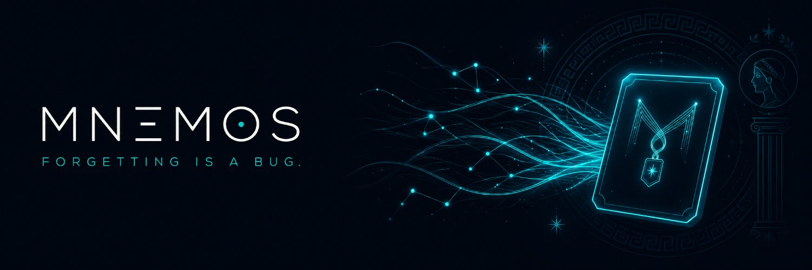

# Mnemos

> **Forgetting is a bug. Mnemos is the fix.**

Mnemos is a local-first personal agent whose durable memory runs on
[Sibyl Memory](https://docs.sibyllabs.org/memory/). Everything you tell it —
preferences, agreements, lessons, tasks — lives in memory you own, and you can
take it anywhere.



[](https://smithery.ai/servers/mnemos/mnemos)

## Why

Old computers had almost no RAM, and memory is what held them back,
not CPU power. The same is happening with agents: models keep getting
smarter while memory still gets lost or costs tokens.

Mnemos is the RAM upgrade for agents. The full case is in
[docs/PMF.md](docs/PMF.md).

## What memory improves

Memory is not the feature. What memory changes is the feature.

- **Money.** Recall answers without a single model call. The same fact
  costs zero tokens forever, and a keepsake restores a full agent with no
  re-teaching.
- **Decisions.** The payment gate refused a real request while the
  agreement was only agreed, then executed it once delivered. Same
  request, opposite outcomes, caused by memory state alone.
- **Failures.** A high severity lesson linked to an agreement vetoes its
  payments until the lesson is resolved. Mistakes stop repeating.
- **Corrections.** When a remembered fact is revised, everything that
  depended on it becomes suspect and the payment gate closes until each
  affected item is explicitly reconsidered. A wrong memory can no longer
  keep paying out.
- **Time.** Tasks survive restarts and `resume` lists what is left, so
  work never dies with the session.

## What it does

- **Remembers you, honestly.** Recall answers only from what memory actually
  holds, and says so when it holds nothing. No invented memories, ever.
- **Agreements with teeth.** A state machine (`draft -> agreed -> delegated ->
  delivered -> paid`) that moves one step at a time, never backward.
- **Memory-gated payments.** Nothing pays out unless a remembered, delivered
  agreement covers the amount. The gate reads memory before it allows anything.
- **Keepsakes.** One command exports everything into a portable `.mne` pack.
  A fresh agent on a fresh machine imports it and remembers you. Packs are
  plain JSON with a sha256 digest: commit them to git like any backup.
- **Lessons.** Failures are stored with severity, so the same mistake stays
  wrong only once.
- **Revision with blast radius.** `revise` corrects a fact, computes what
  depended on it deterministically, and marks affected agreements and tasks
  suspect. The payment gate refuses them until `reconsider` reviews each one.
  History is append-only: every superseded value stays in the journal.
- **Tasks that survive restarts.** `resume` lists unfinished work, work first.
- **Causal replay.** Every write, recall, and refusal is journaled. `replay`
  shows the chain that changed a decision.
- **The deletion test, on demand.** `doctor` proves memory is load-bearing.

## Use Mnemos from any agent (MCP)

`mnemos mcp` serves the same 11 tools (remember, ask, lessons, tasks, replay,
revise, blast, reconsider, suspect, and more) to any MCP client over stdio.

```bash
pip install '.[mcp]'
mnemos mcp --db ~/.mnemos/memory.db
```

Claude Desktop / VS Code / Cursor:

```json
{
  "mcpServers": {
    "mnemos": {
      "command": "mnemos",
      "args": ["mcp", "--db", "C:\\Users\\you\\.mnemos\\memory.db"]
    }
  }
}
```

Remote / hosted: `mnemos mcp --http` serves streamable HTTP on port 8000
(`/mcp`), which is what the Dockerfile and `smithery.yaml` deploy. Live
endpoints: [Railway](https://mnemos-production-2572.up.railway.app/mcp) and
[Smithery](https://smithery.ai/servers/mnemos/mnemos).

## Install

```bash
pip install .
mnemos --db ~/.mnemos/memory.db remember "I like short direct answers"
mnemos ask "how do I like answers?"
```

## The load-bearing map

Every capability below breaks without Sibyl Memory. Judges can reach any call
site in under two minutes.

| Capability | Command | Where the memory call lives |
|---|---|---|
| Durable facts | `mnemos remember` / `ask` | `core/memory/store.py` |
| Honest recall | `mnemos ask` | `core/agent/recall.py` |
| Agreements | `mnemos agree` / `advance` / `delegate` | `core/memory/agreement.py` |
| Payment gate | `mnemos pay` | `core/memory/gate.py`, `core/payments/executor.py` |
| Portable memory | `mnemos keepsake export/import` | `core/memory/keepsake.py` |
| Lessons | `mnemos learn` / `lessons` | `core/memory/lessons.py` |
| Tasks | `mnemos task` / `work` / `block` / `resume` | `core/memory/tasks.py` |
| Causal replay | `mnemos replay` | `core/agent/replay.py` |
| Day summary | `mnemos recap` | `core/agent/recap.py` |
| Reflection | `mnemos reflect` / `proposals` / `accept` | `core/memory/reflection.py` |
| Revision | `mnemos revise` / `blast` / `reconsider` / `suspect` | `core/memory/revision.py` |
| MCP surface | `mnemos mcp` | `core/mcp.py` |
| Deletion test | `mnemos doctor` | `core/memory/doctor.py` |

## The proof in one take

```bash
mnemos remember "I like short direct answers; contractor rate is 40 per hour"
mnemos agree contractor --with alice --amount 160
mnemos delegate contractor --to agent-42 --task "fix the fence"
mnemos keepsake export my-mnemos.mne
# fresh machine, fresh install
mnemos keepsake import my-mnemos.mne
mnemos ask "how do I like answers and what is the contractor rate"
mnemos advance contractor --to delivered
mnemos pay contractor 160
mnemos revise preference contractor_rate_is_40_per_hour 60 --reason corrected
mnemos pay contractor 160   # refused: agreement is suspect, reconsider first
mnemos reconsider agreement contractor --valid --reason "fixed price"
mnemos pay contractor 160   # gate reopened, payment sent
mnemos doctor
```

`pay` is dry-run by default and journals everything. With `--live` and
`MNEMOS_PAYER_KEY` set, it submits a real transaction on Base.

A live Base mainnet payment from a memory-gated decision is recorded in
[docs/VERIFICATION.md](docs/VERIFICATION.md), with the explorer link.

## Honest status

- Base execution is verified live on mainnet, re-run Sep 5 on the final
  code (tx in docs/VERIFICATION.md).
- Virtuals ACP dispatch is verified live with a billed response, re-run
  Sep 5 (response id in docs/VERIFICATION.md).
- No semantic search. Recall uses Sibyl's FTS plus a deterministic lexical
  fallback, on purpose.

## Docs

- [Architecture](docs/ARCHITECTURE.md)
- [Memory model](docs/MEMORY_MODEL.md)
- [Build plan](docs/PLAN.md)
- [Build log](docs/BUILD_LOG.md)
- [Demo script](docs/DEMO_SCRIPT.md)
- [Verification](docs/VERIFICATION.md)
- [Prior work declaration](docs/PRIOR_WORK.md)

## License

MIT — see [LICENSE](LICENSE).
